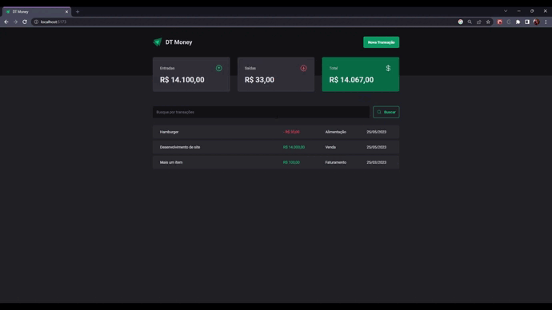

  
  
  <h2> <strong>DT - Money</strong> </h2>

  <h3>Organize suas finanças</h3>

   [Introdução](#-introdução) |
   [Utilização](#-utilizacao) |
   [Tecnologias Utilizadas](#-tecnologias-utilizadas) 

---

# 👨🏻‍💻 Introdução

## Objetivo

A aplicação pode ajudar os usuários a controlar melhor sua vinda financeira, com uma visualização rápida e simples de entradas e saídas de valores.

A criação dessa aplicação foi com o intuito de praticar e aprender mais sobre o desenvolvimento em [ReactJS](https://react.dev/) e suas tecnologias.

Foram utilizadas tecnologias para melhorar a acessibilidade de usuários e também para melhoria em performance da aplicação. Respectivamente: Radix UI e use-context-selector

## Esse repositório possui

- Todo os arquivos de desenvolvimento da aplicação;
- Estruturação em componentes;
- Icons e SVGs utilizados na aplicação.

## Projeto

Esse projeto foi desenvolvido durante o curso Ignite da [Rocketseat](https://rocketseat.com.br/).

 

# 💲 Utilização

  
  

    
  

   

Insira uma nova movimentação preenchendo os dados: descrição, preço, categoria e o tipo (entrada ou saída).

É possível filtrar as movimentações cadastradas pela descrição.

Essa aplicação conta com o `json-server` rodando localmente que irá armazenar todas as transações cadastradas.

 

# 🚀 Tecnologias/Bibliotecas utilizadas

- [ReactJS](https://react.dev/)
- [Zod](https://zod.dev/)
- [Immer](https://immerjs.github.io/immer/)
- [Axios](https://axios-http.com/)
- [Radix UI](https://www.radix-ui.com/)
- [Phosphor Icons](https://phosphoricons.com/)
- [React Hook Form](https://react-hook-form.com/)
- [Styled-components](https://styled-components.com/)
- [Context Selector && Scheduler](https://www.npmjs.com/package/use-context-selector)

---

Made by

- [**Gabriel Carvalho**](https://github.com/GabrielCarvf) 🤘🏻|  [LinkedIn](https://www.linkedin.com/in/gabriel-carvalho-5ba636182/)
